### Introducing Sheepdog, an agentic workflow harness.

I am a serial reader of articles. Well, maybe collector is more appropriate. I expect others can relate, seeing dozens of tailored articles a day, a growing list of tabs, an overflowing inbox.

Is there any hope of reading everything I think I should?

## A day in the life of an article collector

As a software engineering manager, I have interests in a number of areas. Software, management, AI, productivity make up a large portion of my reading list, and Google knows it.

- Opening my Google feed while drinking my morning coffee,
- The engineer–manager pendulum is breaking - open in new tab.
- Back to work.
- Someone shares an article over slack,
- Small Language Models – More Effective And Efficient For Enterprise AI - open in new tab.
- Back to work.

Hopefully at some point I get a chance to revisit the tab, consume, process and output some of the key ideas into my Obsidian knowledge base.

There is still a high amount of content that is not as useful as it could be, enter a new step in my process, introducing an llm to summarise my articles, allowing me to filter them to my interests and their importance.

```mermaid

graph TD

%% Nodes

Article("📰 Web Article")

subgraph Browser ["🖥️ Web Browser"]

Clipper("✂️ Web Clipper")

ChatAI("🤖 Generic AI Chat\n(ChatGPT/Claude)")

end


subgraph Obsidian ["💜 Obsidian / Local"]

RawNote[/"📄 Raw Note"/]

FinalNote[/"📝 Summarized Note"/]

end


%% Human Actions styled with dotted lines to represent manual effort

Article --> Clipper

Clipper -->|"Save"| RawNote

RawNote -.->|1.User Copies Text| ChatAI

ChatAI -.->|2.User Prompts AI| ChatAI

ChatAI -.->|3.User Copies Summary| FinalNote

%% Styling

classDef plain fill:#fff,stroke:#333,stroke-width:1px;

classDef obsidian fill:#7e57c2,stroke:#5e35b1,color:#fff;

classDef browser fill:#42a5f5,stroke:#1e88e5,color:#fff;


class Article plain;

class Clipper,ChatAI browser;

class RawNote,FinalNote obsidian;

linkStyle 2,3,4 stroke:#f44336,stroke-width:2px,stroke-dasharray: 5 5;

```

This manual workflow gets the job done. But surely it could be more efficient, a perfect candidate for automation?

## What even in an automated agentic workflow? 

You wake up in the morning. As you sip your coffee you check your inbox. AI Today, a roundup of the different articles you browsed yesterday. Ideas, concepts and conflicts delivered in a quick read.

You decide to spend some time reading:

Meta AI Proposes Large Concept Models (LCMs): A Semantic Leap Beyond Token-based Language Modeling. It happens to challenge an opinion you expressed at work just that week.

Your research assistant, a configurable AI agent, patrols your folders, herds your files and rounds up your outputs. Meet sheepdog.

## Sheepdog - A local AI agent harness 

Now, I don't have the eco system (browser, notifications, devices, cloud infrastructure) access to make the above a reality, but I can make a start.

Firstly, we could look at workflow orchestrator tools, such as n8n. With self hosted options this can be done for free, however there is still a requirement to build within the limits of their product, plus the overhead of running a docker container or standalone server. Running this locally, with minimal overhead and full control over the solution to allow it to grow with my use cases are all important to me.

Also it's my first real use case for the rust programming language. A safe, lightweight solution, running on my device. This could work with a full local LLM setup as well if required.

I imagined two initial tasks that sheepdog would be able to orchestrate.

1. Herd - triggers an agent when files in the file system are updated.
2. Round up - run agents over folders on a schedule.

Sheepdog is set up to listen to my Obsidian clipper folder and herd incoming documents, generating a summary for each. The agent itself uses only a small prompt to achieve the correct naming, formatting and metadata, with the real key to the solution being able to dynamically execute the agent based on changes to the file system.

```mermaid

graph TD

%% --- Nodes ---

Web(["🌐 Web Page"])

Browser("🖥️ Browser / Clipper")

LLM("🧠 Local LLM")

subgraph FileSystem ["📂 File System"]

direction TB

Inbox[/"📥 Inbox Folder\n(Raw Clippings)"/]

Outbox[/"✨ Vault / Output\n(Processed Notes)"/]

end


subgraph Sheepdog ["🐶 Sheepdog Service"]

direction TB

Patrol("👀 Patrol\n(Watcher)")

Worker("⚙️ Worker\n(Agent)")

end


%% --- Connections ---

Web -->|"User Clips"| Browser

Browser -->|"Saves .md"| Inbox

Inbox -.->|1.Detects New File| Patrol

Patrol -->|2.Triggers Event| Worker

Worker -->|3.Reads Content| Inbox

Worker <==>|4.Process & Summarize| LLM

Worker -->|5.Writes Summary| Outbox


%% --- Styling ---

classDef source fill:#e3f2fd,stroke:#1565c0,stroke-width:2px;

classDef storage fill:#fff9c4,stroke:#fbc02d,stroke-width:2px,stroke-dasharray: 5 5;

classDef process fill:#f8bbd0,stroke:#c2185b,stroke-width:2px;

classDef ai fill:#ede7f6,stroke:#512da8,stroke-width:4px;


class Web,Browser source;

class Inbox,Outbox storage;

class Patrol,Worker process;

class LLM ai;

%% Subgraph Styling

style FileSystem fill:#fff,stroke:#9e9e9e,stroke-dasharray: 5 5

style Sheepdog fill:#fce4ec,stroke:#ec407a,stroke-width:2px

```

Next up I'll be looking to add my article of articles round up, investigating vector embedding and metadata tagging for my files. But for now this provides an extensible but also effective solution to my original workflow issue.

Steps that would previously happen disparately, over the course of a day or two are now instantaneous. I should never miss an article again.

How do you manage your article and research documents?

Would you consider a tool like sheepdog? Let me know your thoughts on bluesky. 